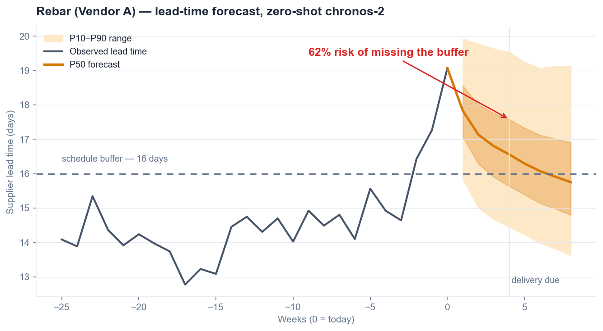
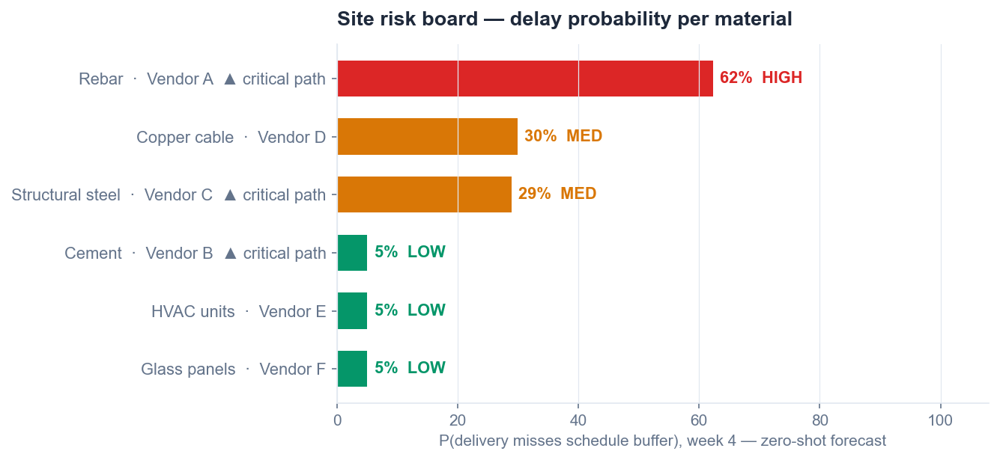

# ChainSentinel

> ChainSentinel forecasts material delays with foundation models, then an agent pulls the contract, alerts the right people, and remembers how every disruption was fixed. Built for construction.

**Team Perceptron (IIT Madras)** — Aman Kumar Maurya · Sai Nikhil Vukka · Abhishek Kumar · Aditya Yash Raj
**Kaya AI IIT India Hackathon 2026 · Track: Supply Chain**

## The problem

98% of construction projects run late, and supply chain disruption drives ~70% of them. The data that could predict a missed delivery — POs, delivery logs, vendor emails — already exists. It is never turned into a probability, and a probability is never turned into an action. ChainSentinel operates in that gap: the window between the first weak signal and the truck that doesn't arrive.

## What it does

**Forecast.** Zero-shot time-series foundation models (Amazon Chronos-2) produce quantile forecasts of lead time, cost, and demand per material. Risk is a real probability — P(arrival later than the schedule buffer) — read directly off the distribution. Zero-shot means the system cold-starts on a brand-new site with no training data.

**Act.** When risk crosses a threshold on a critical-path material, an agent retrieves the PO and the exact contract penalty clause (string-verified), recalls how similar past disruptions were resolved, runs what-ifs through a real critical-path optimizer (the LLM never does the math — OptiGuide pattern), and drafts an alert to the responsible committee with evidence attached. A human approves; the agent executes.

**Remember.** The outcome — action taken, response time, cost delta — is written back to episodic and per-vendor outcome memory. Every disruption makes the next one cheaper.

## Stage 1 demo (working code)

The forecasting core runs end to end against the real `amazon/chronos-2` model:

```bash
pip install -r demo/requirements.txt
python demo/chainsentinel_demo.py
```

Simulated lead-time histories (methodology disclosed in the script), zero-shot inference, and two outputs:





The 62% rebar risk is a genuine model output — the forecaster never trains on our simulated data, so results are not tuned to flatter it.

## Design notes (research-grounded)

- **Two-layer forecasting:** published work shows history-only foundation models miss covariate-driven regime changes — and disruptions are regime changes. So a foundation-model baseline is combined with an explicit shock layer (vendor notices, weather, port status) that adjusts risk on top of the quantiles.
- **Memory-retrieval agents:** supply-chain agents that retrieve similar historical experiences make measurably better decisions (Yoshizato et al., Feb 2026). Outcome records require human confirmation before commit — no memory poisoning.
- **Known failure modes designed around:** SupChain-Bench (2026) shows LLM agents fail at long-horizon orchestration → short structured workflows (≤5 steps), constrained tools, human approval gate.

Full citations and architecture: [PROPOSAL.md](PROPOSAL.md) · risk register and fallbacks: [RELIABILITY-AUDIT.md](RELIABILITY-AUDIT.md)

## Repository layout

| Path | Contents |
|---|---|
| `demo/` | Stage 1 working demo — Chronos-2 zero-shot forecasting + risk board |
| `STAGE1/` | Submission package: proposal (docx), 10-slide deck (pptx), video script, Devpost content |
| `PROPOSAL.md` | Full project proposal with research citations |
| `RELIABILITY-AUDIT.md` | Honest audit: real-world reliability, failure modes, fallbacks |

## Roadmap (Stage 2 — by July 31)

Two-layer forecasting with conformal calibration evaluated against naive baselines · critical-path optimizer with what-if interface · agent with document retrieval and citation verification · episodic + outcome memory with write-back · live risk-board dashboard.
